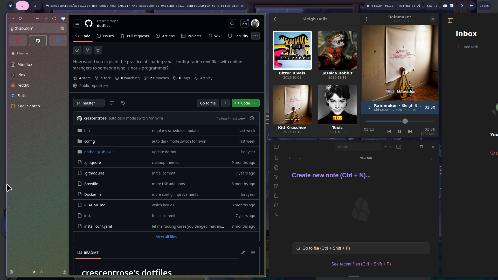

# crescentrose's dotfiles

## Setup

This is a standard Nix flake. so on a NixOS system, running `sudo nixos-rebuild
--flake ./nixos#starlight switch` should do the trick. Note that you will need a
handful of _secrets_ - refer to the flake files for details. Also, the wallpaper
directory is not distributed as a part of this repo as that would be rude to
the artists - find your own wallpapers! Improving the setup experience is on my
to-do list, but it's not yet ready.

Note that this set-up is tweaked for my desktop PC and is currently not very
modular or extensible. Improving this is also on my to-do list.
