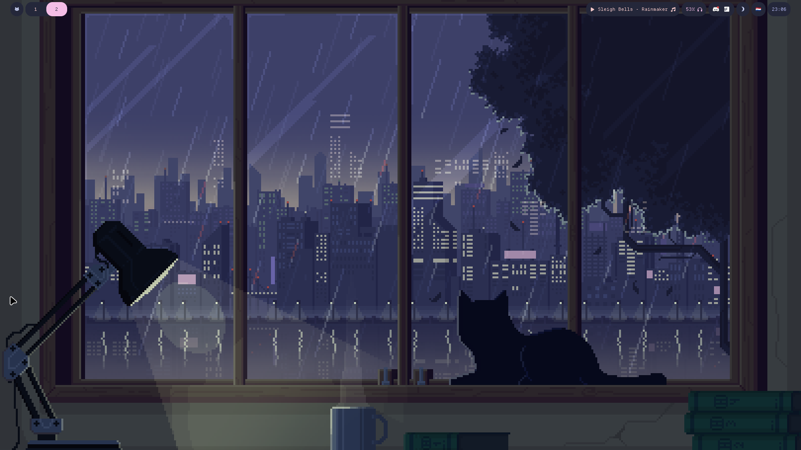
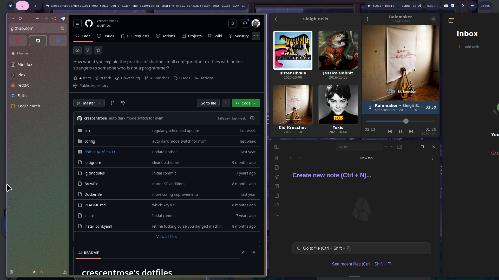

# crescentrose's dotfiles

> [!WARNING]
> This is a highly experimental NixOS branch. Here be dragons!

## Setup

This is a standard Nix flake. so on a NixOS system, running `sudo nixos-rebuild --flake
./nixos#streaming-heart switch` should do the trick. Note that you will need a handful of
_secrets_ - refer to the flake files for details. Also, the wallpaper directory is not distributed
as a part of this repo as that would be rude to the artists - find your own wallpapers! Improving
the setup experience is on my to-do list, but it's not yet ready.

Note that this set-up is tweaked for my desktop PC and is currently not very modular or
extensible. Improving this is also on my to-do list.

## What's included?

For the system:

- [Niri](https://github.com/YaLTeR/niri) - a horizontally scrolling Wayland compositor
- [Waybar](https://github.com/Alexays/Waybar) - with a handful of custom widgets for things like
  light/dark mode switching.
- [Hyprlock](https://github.com/hyprwm/hyprlock?tab=readme-ov-file) for a pleasant screen lock
  experience
- Mako as the notification daemon
- Rofi as the launcher

Additional apps include:

- basic GNOME apps
- basic productivity apps that I use (Obsidian, Todoist, 1password, etc.)
- [Zen browser](https://zen-browser.app/) for, well, browsing
- a kick-ass [Neovim](https://neovim.io/) setup, if I can humbly say so myself
- Steam - gaming ready!
