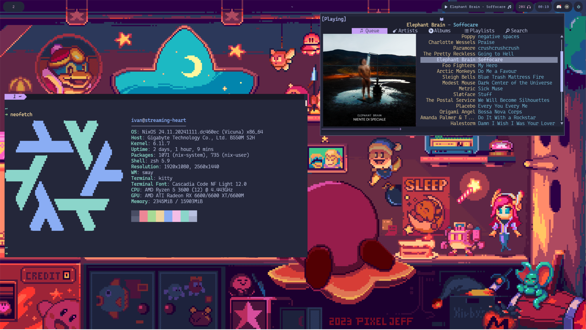

# crescentrose's dotfiles

> [!WARNING]
> This is a highly experimental NixOS branch. Here be dragons!



## setup

After the setup, remember to **create a local gitconfig file** at `~/.config/gitconfig.local`. It
should, at minimum, contain your name, email and signing key, but I usually put in the 1password
signing config and any other private repo configuration I might have.

### starship (prompt)

starship requires some extra setup with `nushell`:

```nu
mkdir ~/.cache/starship                                 # set up cache directory
starship init nu | save -f ~/.cache/starship/init.nu    # initialize cache
```

[source](https://starship.rs/guide/#%F0%9F%9A%80-installation)

## what's in the box

The dotfiles contain:

- Straightforward [kitty](https://github.com/kovidgoyal/kitty) and
  [nushell](https://www.nushell.sh/) setups with the [starship](https://starship.rs/) prompt
- A mildly polished [neovim](https://neovim.io/) config with LSP, debugging and other plugins
  focused on a nice development experience
- [mise](https://mise.jdx.dev/) for version management and a basic Git config

The Neovim config is explained in more details in a dedicated help file. Run
[`:h crescentrose`](./config/nvim/doc/crescentrose.txt) to get more info.
