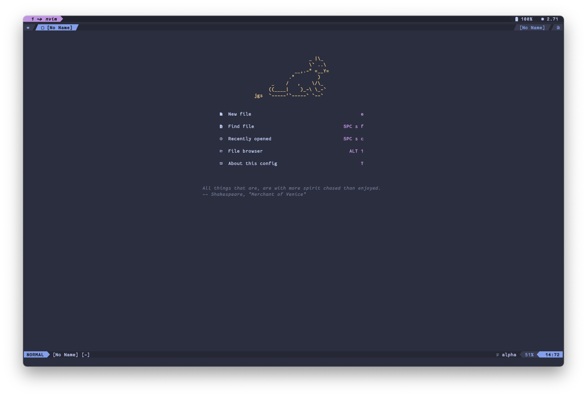
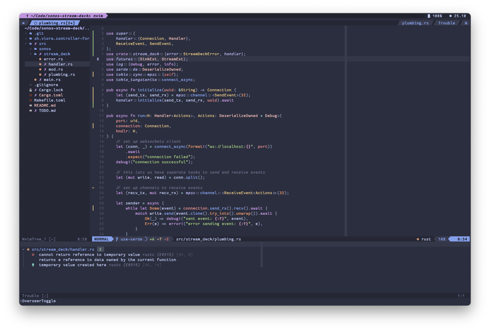

# crescentrose's dotfiles

revamped and enhanced for the next five years

<details>
<summary>screenshot: clean</summary>



</details>

<details>
<summary>screenshot: dirty</summary>



</details>

## setup

Clone the repository with submodules:

```sh
git clone --recursive git@github.com:crescentrose/dotfiles.git
```

### apps

The `Brewfile` should contain most apps I use on a regular basis, as well as all the CLI tools
referenced in this repo. It is divided into feature groups - by default, running `brew bundle` will
install all packages, but you can customize it by setting the `HOMEBREW_FEATURES` environment
variable to a comma-separated list of groups, like so:

```sh
HOMEBREW_FEATURES=basic,dev brew bundle # installs only `basic` and `dev` groups
HOMEBREW_FEATURES=cloud brew bundle # only set up the cloud development tools
```

The groups are:

| Group     | Contents                                                                       |
| --------- | ------------------------------------------------------------------------------ |
| `basic`   | core dependencies: terminal emulator, shell, coreutils, fonts, basic CLI tools |
| `dev`     | development tools: version managers, compilers/interpreters, other tools       |
| `desktop` | desktop apps served as casks                                                   |
| `mac`     | desktop apps from the Mac App Store                                            |
| `cloud`   | cloud development tools like docker, openshift, k8s, google cloud, terraform   |

After the setup, remember to **create a local gitconfig file** at `~/.config/gitconfig.local`. It
should, at minimum, contain your name, email and signing key, but I usually put in the 1password
signing config and any other private repo configuration I might have.

### starship (prompt)

starship requires some extra setup with `nushell`:

```nu
mkdir ~/.cache/starship                                 # set up cache directory
starship init nu | save -f ~/.cache/starship/init.nu    # initialize cache
```

[source](https://starship.rs/guide/#%F0%9F%9A%80-installation)

## what's in the box

The dotfiles contain:

- Straightforward [kitty](https://github.com/kovidgoyal/kitty) and
  [nushell](https://www.nushell.sh/) setups with the [starship](https://starship.rs/) prompt
- A mildly polished [neovim](https://neovim.io/) config with LSP, debugging and other plugins
  focused on a nice development experience
- [mise](https://mise.jdx.dev/) for version management and a basic Git config

The Neovim config is explained in more details in a dedicated help file. Run
[`:h crescentrose`](./config/nvim/doc/crescentrose.txt) to get more info.

## links

Dotfiles are managed with [Dotbot](https://github.com/anishathalye/dotbot).

kitty icon: [whiskers](https://github.com/igrmk/whiskers)
([instructions](https://sw.kovidgoyal.net/kitty/faq/#i-do-not-like-the-kitty-icon))
